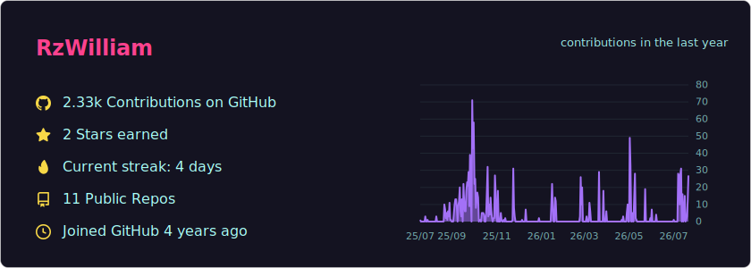

# 📊 GitHub Stats Card — self-hosted

Generate your **own** GitHub stats card in SVG, regenerated automatically by
GitHub Actions. Just like the public services (github-profile-summary-cards, etc.),
but **rate-limit free**: the only call to the GitHub API happens on the runner with
your token (5000 req/h), and visitors only load a plain static image file.



## How it works

```
Cron (every 6h)  ─►  GitHub Action  ─►  fetch GitHub API (your token)
                                     ─►  generate the .svg
                                     ─►  commit into generated/
Your profile README  ─►  shows generated/overview.svg  (static file = never rate limited)
```

No dependencies: just native Node (`fetch`, file writing).

## Setup

1. **Create a repo** (e.g. `github-stats`) and push this code into it.

2. **(Recommended) Create a token** to also include your private contributions:
   - GitHub → *Settings* → *Developer settings* → *Personal access tokens* → *Tokens (classic)*
   - Scope: **`read:user`** (and `repo` if you want to count private repos/stars)
   - Add it to your repo: *Settings* → *Secrets and variables* → *Actions* → *New secret*
   - Name: **`GH_TOKEN`**

   > Without a personal token, the Action's default `GITHUB_TOKEN` is enough for public data.

3. **(Optional) Configure** via *Settings* → *Secrets and variables* → *Actions* → *Variables* tab:
   - `GH_USERNAME` — your GitHub handle (defaults to the repo owner)
   - `GH_THEME` — `radical` (default), `dark`, `dracula`, `tokyonight`, `light`

4. **Run it once**: *Actions* tab → *Generate stats card* → *Run workflow*.
   After that it runs on its own every 6h.

## Show the card on your profile

In the `README.md` of your profile repo (`RzWilliam/RzWilliam`):

```markdown

```

> Use the `raw.githubusercontent.com` URL (not `camo`): GitHub refreshes its cache
> automatically whenever the file changes.

## Run locally

```bash
GH_TOKEN=your_pat GH_USERNAME=RzWilliam node src/index.mjs
# → writes generated/overview.svg
```

## Structure

```
src/
  index.mjs      entry point (fetch + write the SVG)
  github.mjs     GraphQL API queries (profile, stars, all-time contributions, calendar)
  analyze.mjs    computations (streak, axis scale, month markers)
  theme.mjs      color themes (add yours here)
  svg.mjs        shared SVG helpers (icons, number formatting)
  cards/
    overview.mjs the combined card (stats + yearly graph)
.github/workflows/
  generate.yml   cron + automatic commit
generated/       the produced SVG (committed, referenced by your README)
```

## Customize

- **Add a theme**: copy a block in [`src/theme.mjs`](src/theme.mjs).
- **Change the frequency**: edit the `cron` in [`.github/workflows/generate.yml`](.github/workflows/generate.yml).
- **New card**: create `src/cards/xxx.mjs` exporting a `render...(stats, theme)` function
  and wire it into [`src/index.mjs`](src/index.mjs).
